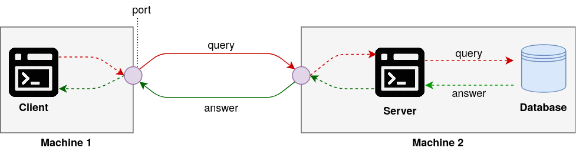
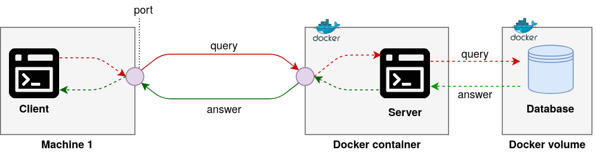

# Exercise 00 - Setup

|                       |      |
| --------------------: | ---- |
|   Turn-in directory : | ex00 |
|    Files to turn in : | None |
| Forbidden functions : | None |
|             Remarks : | n/a  |

## The client-server architecture

PostgreSQL is an open-source database wich follows a client-server architecture. It is divided in three different components :
- a **client**, a program on the user's machine which communicates the user's query to the server and receives the server's answers. 
- a **server**, a program running in the background that manages access to a specific resource, service or network. The server will understand the client's query and apply it to the database. Then it will send an answer to the client.
- a **database system**, where the data is stored.

{width=600px}

ps: client and server can be located on the same machine

In the case of PostgreSQL, we are going to use `psql` as a client and `pg_ctl` for the server.

## PostgreSQL dockerised architecture

Docker is a tool which allows us to isolate an environment like a virtual machine. HOWEVER, docker is not a virtual machine! It's more like an application running on the operating system and emulating an operating system.

An important point in using a database is the isolation and protection of the data. A way to do that is to isolate the server program from the database. We can use docker volumes combined with docker container to do that, as shown below. 

\clearpage

{width=600px}

The advantage of this architecture is that even if the docker container with the server fails, we still have the data on the docker volume.

## PostgreSQL docker installation

We are going to install Postgres server through docker. The first thing we need to do is install Docker-CE. You can find a script to install docker on your mac in the `resource` directory of the day.

```
sh docker_install.sh
```

We just need a Postgres client now (`psql`).

```
brew install libpq
```

Then we need to create a docker volume. It will store the database data.

```
docker volume create db-data
```

Docker-compose will run a container with the last version of Postgres. The container Postgres port `5432` bound to the port `54320` of our local machine. The default user and password for Postgres is now `postgres`.

```dockerfile
FROM postgres:12.2-alpine

# run init.sql
ADD init.sql /docker-entrypoint-initdb.d
ADD pg_hba.conf /var/lib/postgresql/data
```

The `init.sql` will create a user `postgres_user` with the password `12345` (a very strong password indeed!) and a database (`appstore_games`) for the day.

```sql
CREATE DATABASE appstore_games;
CREATE USER postgres_user WITH PASSWORD '12345';
ALTER DATABASE appstore_games OWNER TO postgres_user;
```

\clearpage

Now, you can run docker-compose!

```
$> docker-compose up
Starting resource_db_1 ... 
Starting resource_db_1 ... done
Attaching to resource_db_1
db_1  | 
db_1  | PostgreSQL Database directory appears to contain a database; Skipping initialization
db_1  | 
db_1  | 2020-05-02 20:27:47.354 UTC [1] LOG:  starting PostgreSQL 12.2 on x86_64-pc-linux-musl, compiled by gcc (Alpine 9.2.0) 9.2.0, 64-bit
db_1  | 2020-05-02 20:27:47.354 UTC [1] LOG:  listening on IPv4 address "0.0.0.0", port 5432
db_1  | 2020-05-02 20:27:47.354 UTC [1] LOG:  listening on IPv6 address "::", port 5432
db_1  | 2020-05-02 20:27:47.359 UTC [1] LOG:  listening on Unix socket "/var/run/postgresql/.s.PGSQL.5432"
db_1  | 2020-05-02 20:27:47.370 UTC [20] LOG:  database system was shut down at 2020-05-02 20:23:08 UTC
db_1  | 2020-05-02 20:27:47.373 UTC [1] LOG:  database system is ready to accept connections
```

Now, we can connect to the server through `psql`. As said previously, the password is `postgres`.

```
$> psql -h 0.0.0.0 -p 54320 -U postgres
psql (12.1)
Type "help" for help.

postgres=# 
```

`\?` allows you to see all the possible commands in the PostgreSQL console.
The first thing we can do is list the databases with `\l`.

```bash
postgres=# \l
                                      List of databases
      Name      |     Owner     | Encoding |  Collate   |   Ctype    |   Access privileges   
----------------+---------------+----------+------------+------------+-----------------------
 appstore_games | postgres_user | UTF8     | en_US.utf8 | en_US.utf8 | 
 postgres       | postgres      | UTF8     | en_US.utf8 | en_US.utf8 | 
 template0      | postgres      | UTF8     | en_US.utf8 | en_US.utf8 | =c/postgres          +
                |               |          |            |            | postgres=CTc/postgres
 template1      | postgres      | UTF8     | en_US.utf8 | en_US.utf8 | =c/postgres          +
                |               |          |            |            | postgres=CTc/postgres
```

We are ready to use Postgres!

## Pyenv install

Dealing with Python is often hell when it comes to python versions and librairies version. This problem is often encountered few people are working on the same server with different library needs.
Furthermore you don't want to mess with the system python. That's why virtual environments and separated python are a prefered solution.

You can install pyenv with brew using the following command.

```
brew install pyenv
```

All the python candidates can then be listed.

```
pyenv install --list | grep " 3\.[678]"
```
... and installed. For the day we are going to choose version `3.7.6`.

```
pyenv install -v 3.8.0
```

Finally the installed version can be activated through this command.

```
pyenv global 3.8.0
```

Don't forget to add those lines to your `.zshrc` file in order to activate your python environment each time you open a terminal.

```
export PATH="/home/misteir/.pyenv/bin:$PATH"
eval "$(pyenv init -)"
eval "$(pyenv virtualenv-init -)"

pyenv global 3.8.0 #activate the python 3.8.0 as default python
```

## Pipenv install

Pipenv is a tool to handle packages versions of an environment. This tool is very similar to the `requirements.txt` file with some extra metadata.

Pipenv can be installed with this simple command.

```
pip install pipenv
```

You can find a toml file for the day named `Pipfile`.

```
[[source]]
url = "https://pypi.python.org/simple"
verify_ssl = true
name = "pypi"

[packages]
jupyter = "*"
numpy = "*"
pandas = "*"
psycopg2 = "*"

[requires]
python_version = "3.8.0"
```

To setup your environment just follow these two steps.

```
pipenv install
pipenv shell
```

You have now PostgreSQL, virtual python and requirements installed and ready for the day!
