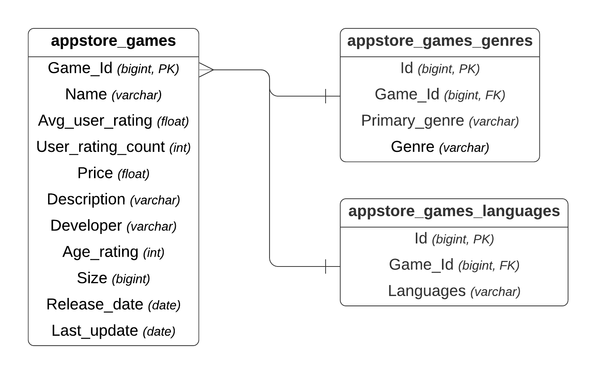

# Exercise 03 - Populate
|                         |                    |
| -----------------------:| ------------------ |
|   Turnin directory :    |  ex03              |
|   Files to turn in :    |  populate.py       |
|   Forbidden function :  |  None              |
|   Remarks :             |  n/a               |

## Objective

You must insert :
* `appstore_games.normalized.csv`
* `appstore_games_genres.normalized.csv`
* `appstore_games_languages.normalized.csv` 

data into a postgreSQL table.

## Instructions

You can read the psycopg2_basics documentation (some included functions will help you for this exercise). You can use any PostgreSQL keywords included in the given documentation.

1) You first need to create 3 functions
- `create_appstore_games`
- `create_appstore_games_genres`
- `create_appstore_games_languages`

... to create the following tables :

{width=450px}

nb : Foreign keys are a reference to an existing column in another table.

2) You will have to create the 3 populate functions

* `populate_appstore_games`
* `populate_appstore_games_genres`
* `populate_appstore_games_languages`

... to insert data into the different tables.

Before you do anything you must ensure postgresql is running.

# Examples

At the end your display table should show the following output for the table :

* `appstore_games_genres`

```python
>> display_table("appstore_games_genres")
(0, 284921427, 'Games', 'Strategy')
(1, 284921427, 'Games', 'Puzzle')
(2, 284926400, 'Games', 'Strategy')
(3, 284926400, 'Games', 'Board')
(4, 284946595, 'Games', 'Board')
(5, 284946595, 'Games', 'Strategy')
(6, 285755462, 'Games', 'Strategy')
(7, 285755462, 'Games', 'Puzzle')
(8, 285831220, 'Games', 'Strategy')
(9, 285831220, 'Games', 'Board')
```

* `appstore_games_languages`

```python
>> display_table("appstore_games_languages")
(0, 284921427, 'DA')
(1, 284921427, 'NL')
(2, 284921427, 'EN')
(3, 284921427, 'FI')
(4, 284921427, 'FR')
(5, 284921427, 'DE')
(6, 284921427, 'IT')
(7, 284921427, 'JA')
(8, 284921427, 'KO')
(9, 284921427, 'NB')
```
