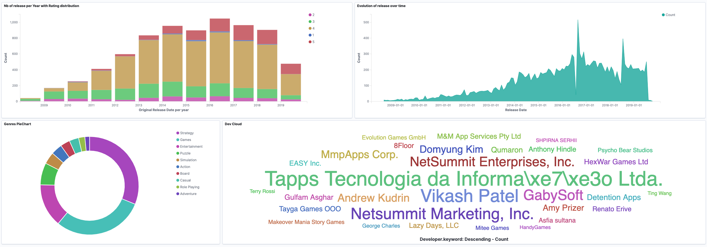

# Exercise 10 - Kibana

|                         |                    |
| -----------------------:| ------------------ |
|   Turn-in directory:    |  ex10              |
|   Files to turn in:     |  ex10-rendu.txt    |
|   Forbidden functions:  |  None              |
|   Remarks:              |                    |

Time to explore Kibana a little bit more.

- Your goal is to create a Dashboard with the following visualizations:

  - A plot showing the number of games released (Y axis) over time (X axis)
  - A histogram that counts the number of games released each year, and for each year the count of the "average user rating" by an interval of 1
  - A Pie Chart showing the repartition of Genres
  - A cloud of words showing the top developers

- Once your dashboard has been created, explore the possibilities of Kibana (click on the top developer in the cloud of words for instance).

Your Dashboard should look like something like this:  

{width=550px}

### Hints

- You need to create an index pattern first (Go in the management menu, then index pattern).
- Create each visualization in the visualization tab and then create the dashboard in the dashboard tab.
