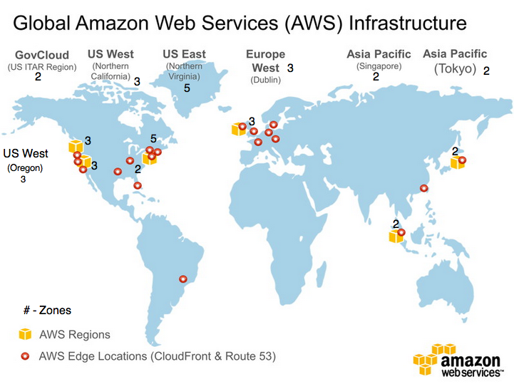
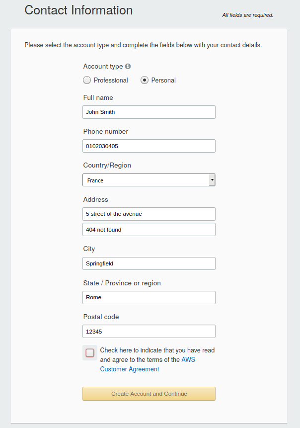
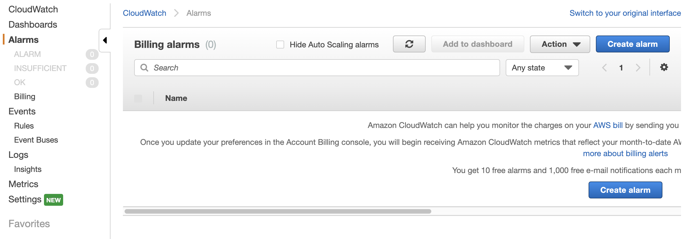
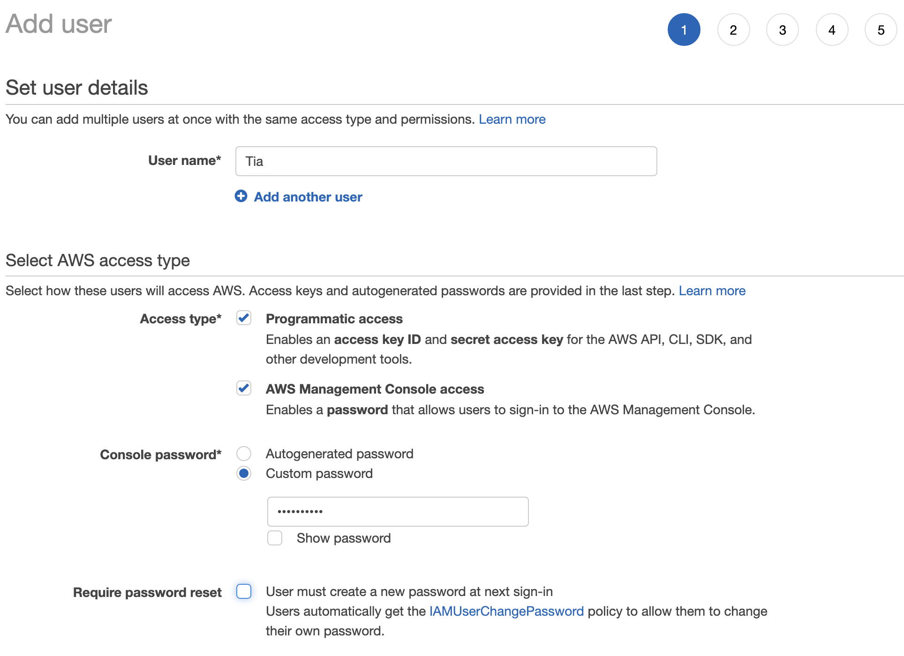
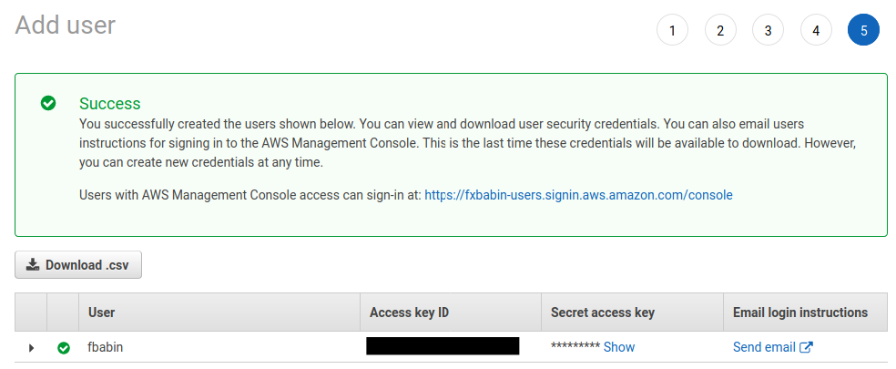
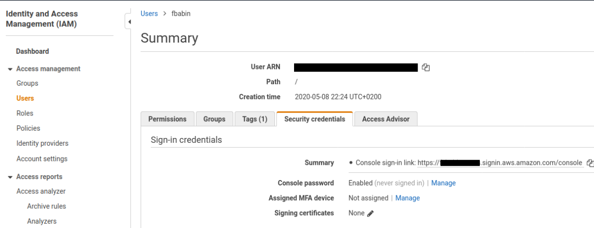

# Exercise 00 - Setup

|                         |                    |
| -----------------------:| ------------------ |
|   Turn-in directory:    |  ex00              |
|   Files to turn in:     |                    |
|   Forbidden function:   |  None              |
|   Remarks:              |  n/a               |

## What is the Cloud?

Cloud computing is the on-demand delivery of IT resources and applications via the Internet with pay-as-you-go pricing. In fact, a cloud server is located in a data center that could be anywhere in the world.

Whether you run applications that share photos to millions of mobile users or deliver services that support the critical operations of your business, the cloud provides rapid access to flexible and low-cost IT resources. With cloud computing, you don’t need to make large up-front investments in hardware and spend a lot of time managing that hardware. Instead, you can provision exactly the right type and size of computing resources you need to power your newest bright idea or operate your IT department. With cloud computing, you can access as many resources as you need, almost instantly, and only pay for what you use.

In its simplest form, cloud computing provides an easy way to access servers, storage, databases, and a broad set of application services over the Internet. Cloud computing providers such as AWS own and maintain the network-connected hardware required for these application services, while you provision and use what you need for your workloads.

As seen previously, Cloud computing provides some real benefits :

- **Variable expense**: You don't need to invest in huge data centers you may not use at full capacity. You pay for how much you consume!
- **Available in minutes**: New IT resources can be accessed within minutes.
- **Economies of scale**: A large number of users enables Cloud providers to achieve higher economies of scale translating at lower prices.
- **Global in minutes**: Cloud architectures can be deployed really easily all around the world.

Deployments using the cloud can be `all-in-cloud-based` (the entire infrastructure is in the cloud) or `hybrid` (using on-premise and cloud).

## AWS global infrastructure

Amazon Web Services (AWS) is a cloud service provider, also known as infrastructure-as-a-service (`IaaS`). AWS is the clear market leader in this domain and offers much more services compared to its competitors.

AWS has some interesting properties such as:

- **High availability** : Any file can be accessed from anywhere
- **Fault tolerance**: In case an AWS server fails, you can still retrieve the files (the fault tolerance is due to redundancy).
- **Scalability**: Possibility to add more servers when needed.
- **Elasticity**: Possibility to grow or shrink infrastructure.

AWS provides a highly available technology infrastructure platform with multiple locations worldwide. These locations are composed of `regions` and `availability zones`.

Each region represents a unique geographic area. Each region contains multiple, isolated locations known as availability zones. An availability zone is a physical data center geographically separated from other availability zones (redundant power, networking, and connectivity).

You can achieve high availability by deploying your application across multiple availability zones.

{width=400px}

The `edge locations` you see on the picture are endpoints for AWS which are used for caching content (performance optimization mechanism in which data is delivered from the closest servers for optimal application performance). Typically consists of CloudFront (Amazon's content delivery network (CDN)).

## AWS account registration

When you create a new account on AWS, you get an AWS Free Tier. The latter allows you to use some of the AWS resources for free each month for one year.

In order to create an AWS account, you must visit the following [address](https://aws.amazon.com).

Then, click on the "Create an account" button and fill the following form.

{width=240px}

\newpage

{width=245px}

Don't worry! Even if you enter your card number, this day is not going to cost you anything. First, indeed, AWS as a free tier usage that allows you to use a small amount of AWS resources for free. This will be sufficient enough for what you are going to do today. By the end of the day, you will have to entirely destroy your infrastructure (don't keep things running) !!!

In the next form, choose the `basic plan`, which is free.

To connect to AWS, use your email and password. You will then access to your root account. The root account **MUST NOT** be used directly when using AWS resources for security purposes. You will later create IAM users to use AWS resources in a safer way.

## Discover AWS console

The console allows searching for specific services. By default, services are sorted by groups but they can also be sorted alphabetically.

{width=600px}

You will notice there is a link for a resource group. Resource groups allow you to take a collection of AWS resources and assign them a tag (a label) so they can be managed as a group.

The pushpin is for one-click navigation. It allows you to create shortcuts for the most commonly used resources.

{width=600px}

The alarm icon enables you to see all system alerts. Click it to see more details about the issues and their current status.

{width=200px}

Then, you have account information and the selected AWS regions you are working on (note that all resources are not available for every region).

The support center allows us to create cases when we encounter problems (we can see the support plan here, which will influence AWS response time).

## Setting up a billing alarm

In order to avoid any big mistake (forget to destroy your infrastructure and it cost you some money), we are going to set an alarm to tell us if we have a cost superior to 1$.

We first type `billing` into the AWS search services bar.

{width=450px}

Then we can go in the `Billing preferences` section and validate `Receive Free Tier Usage Alerts` (we have to enter an email). We can also set `Receive Billing Alerts` then we have to save preferences. We can now receive billing alerts !

Now we need to go CloudWatch to configure a billing alert. Cloudwatch is the AWS monitoring system used to track performances of AWS resources.

Go to the `CloudWatch` section and then the `Alarm/Billing` subsection. Click `Create alarm`.

{width=450px}

You have to `select metric`. Two types of metrics exist: `by service` or `Total estimated charges`. Select `Total estimated charges` and `USD` as currency. The threshold you will need is `static` and `greater or equal` to 1 $.

{width=450px}

On the configure actions page, keep `in alarm`. For the notification, use SNS (Simple Notification Service). You are going to `create a new topic` with the name "BillingAlarm" and enter your email address. You can then create the SNS topic.

For the SNS topic to work, we need to confirm our email address (confirmation in the AWS email).

Choose `select an existing SNS topic` with "BillingAlarm".

Then, add the name and the description of the alarm. Your alarm is finally created!

## Create an IAM user

AWS recommends not to use root accounts for day to day administrative tasks. Thus, you are going to create a new IAM user and attach the administrative access policy to it. As a best practice, AWS recommends granting users the minimum access to resources to accomplish their day to day tasks.

First, go to the `IAM` service (IAM stands for Identity and access management). To create a user, go to the dashboard into the `users` section, then `add user`.

{width=450px}

Enter the name of the new user and select an access type. Select both `Programmatic access` and `AWS Management Console access`. Accesses will be seen later.
Then, select an automatically generated password or custom password (here, a custom password is used). You are able to force the user to change of their password when they log in.

The second step is to set permissions for the new user. For the first one, attach an `AdministratorAccess` policy (which grants the user full access to all AWS services).

Besides, a tag can be added to the user (optional). The last step is to review all the options set for the user. The user is finally created!

\newpage

{width=400px}

At the end, you will see the following screen. The access key is really important as it will be used in the next exercise. Save the CSV file otherwise, you will never ever have access to the secret key again.

{width=400px}

By going in IAM, Users, and clicking your newly created user, the security credential panel will show you the sign-in link for the user. Use it to log to the console more safely.

{width=400px}
