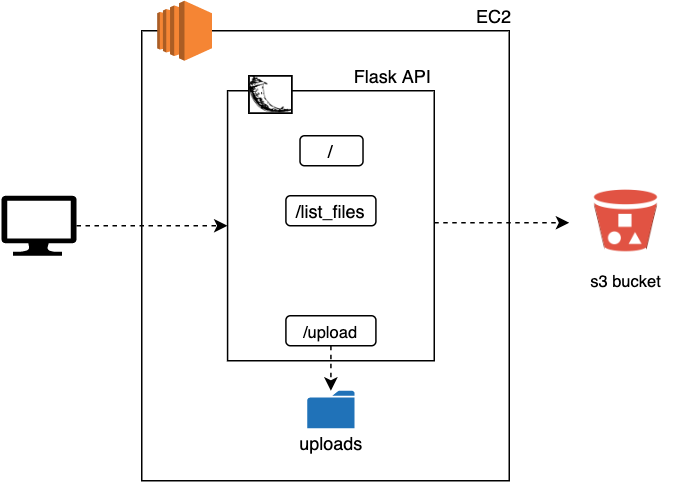
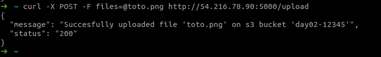

# Exercise 04 - Flask API - Upload.

|                         |                    |
| -----------------------:| ------------------ |
|   Turn-in directory:    |  ex04              |
|   Files to turn in:     |  app.py, s3_funcs.py |
|   Forbidden function:   |  None              |
|   Remarks:              |  n/a               |

We will continue to work on our Flask API to add new functionalities. This time we will work around file upload. Files upload can hardly be done without using proxy storage (data streams is an alternative to the proxy solution but are harder to implement so we will focus on an easier solution). Uploaded files will first be stored onto our EC2 before being sent to the s3 bucket.

{width=400px}

## Exercise

For this exercise you will have to create a directory called `uploads` which will be used to save files before sending them to the s3 bucket. Then you will have to add the '/upload' route to your Flask API. It has to follow those constraints:
    - success
        - status : '200'
        - message : "Successfully uploaded '<file>' to the bucket '<bucket_name>'"
    - file not found error
        - status : '404'
        - message : "The file '<file>' was not found"

The content you return with your Flask API has to be json formatted. You should use boto3 to interact with the s3 bucket you previously (`day02-...`).

## Examples

For the route '/upload'

{width=600px}