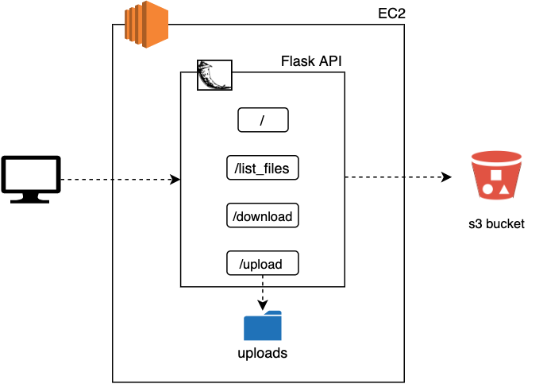
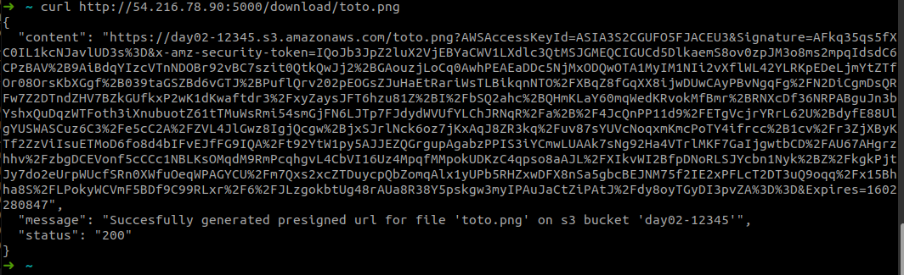

# Exercise 05 - Flask API - Download.

|                         |                    |
| -----------------------:| ------------------ |
|   Turn-in directory:    |  ex05              |
|   Files to turn in:     |  app.py, s3_funcs.py |
|   Forbidden function:   |  None              |
|   Remarks:              |  n/a               |

In order to finish our Flask API we will implement one last functionnality, the download. For this exercise we are going to avoid the proxy solution. Indeed, we have an easier and faster solution to do that. You remember ? Yes, i am talking about presigned URLs !

{width=400px}

## Exercise

For this exercise you will have to create a directory a route '/download/`<file>`' which will create a presigned url with an expiring time of 2 minutes. Your route has to follow the following constraints:
    - sucess
        - status : '200'
        - messsage : "Succesfully generated presigned url for '`<file>`'"
        - content : "`<presigned_url>`"
    - file not found error
        - status : '404'
        - messsage : "The file '`<file>`' was not found on the bucket '`<bucket_name>`'"

Once you are done, create an AMI of your EC2 instance called `day02-flask-api-ami`. This will be used in further exercises.

The content you return with your Flask API has to be json formatted. You should use boto3 to interact with the s3 bucket you previously (`day02-...`).

## Examples

For the route '/download'

{width=600px}