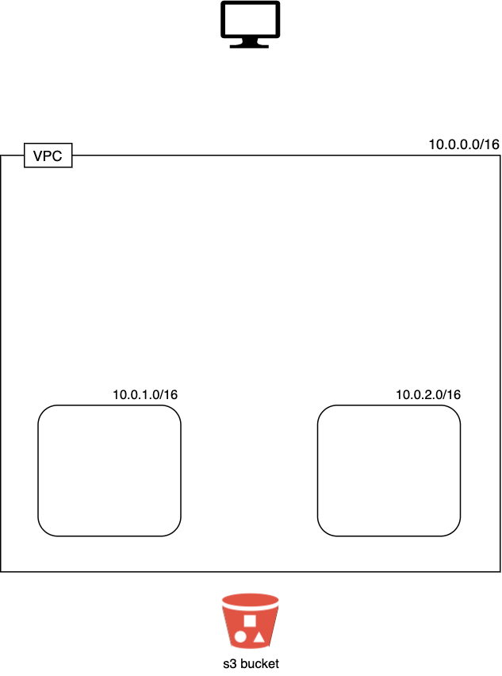

# Exercise 07 - Subnets

|                         |                    |
| -----------------------:| ------------------ |
|   Turn-in directory:    |  ex07              |
|   Files to turn in:     |  00_variables.tf, 01_networking.tf, 10_terraform.auto.tfvars |
|   Forbidden function:   |  None              |
|   Remarks:              |  n/a               |

Within our newly created VPC we want to divide the network's IPs into subnets. This can be useful for many different purposes and helps isolate groups of hosts together and deal with them easily. In AWS, subnets are often associated with different availability zones which guarantees the high availability in case if one of the AWS data centers implied in our infrastructure is destroyed.

{width=300px}

## Exercise

Within our previously created VPC, add 2 subnets with the following characteristics:
- their depends on the creation of the VPC (it has to be specified on terraform)
- your subnets will use `10.0.1.0/24` and `10.0.2.0/24` CIDR blocks.
- your subnets will use `eu-west-1a` and `eu-west-1b` availability zones.
- they must map public ip on launch.
- they must have two tags:
    - `project_name` with the value `day02`
    - `Name` with the value: `day02-sn-pub-1`/`day02-sn-pub-2` (depending on the subnet you create)
