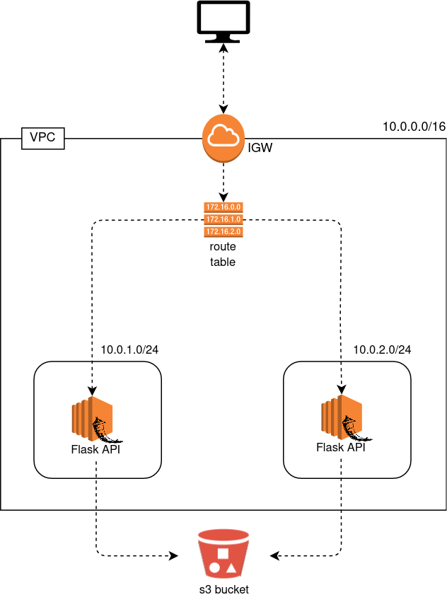

# Exercise 09 - EC2 - Security groups.

|                         |                    |
| -----------------------:| ------------------ |
|   Turn-in directory:    |  ex09              |
|   Files to turn in:     |  02_ec2.tf, 08_security_groups.tf, *.tf, *.tfvars |
|   Forbidden function:   |  None              |
|   Remarks:              |  n/a               |

We finally have an infrastructure we can work with ! Now let's work on our EC2 instance. We will use the ami we saved to provision our EC2 instance and automatically run our Flask application.

{width=300px}

## Exercise

Create a security group called `day02-flask-sg` for your EC2 instance :
- this security group depends on the creation of the subnets
- it must allow ssh traffic from anywhere (or your ip only if you prefer)
- it must allow traffic through the port `5000` for your Flask application to work

Create an EC2 resource which :
- depends on the creation of the subnets
- must associate public ip address (it is useful if we want to ssh)
- must use :
    - a `t2-micro` instance type
    - the ami you previously saved
    - the security group you just created
    - the `s3_access` role you created

Even with all these setup one step is still missing, when starting our instance the Flask application is not running ! If we want our application to start when we instanciate our EC2 we will need to provide user data. User data is a script we will run when an instance starts.

Add user data to start your flask application. You will need to use `nohup` and `&` (background command) for your command to work. 

The curl commands must work just after you applied your terraform infrastructure.