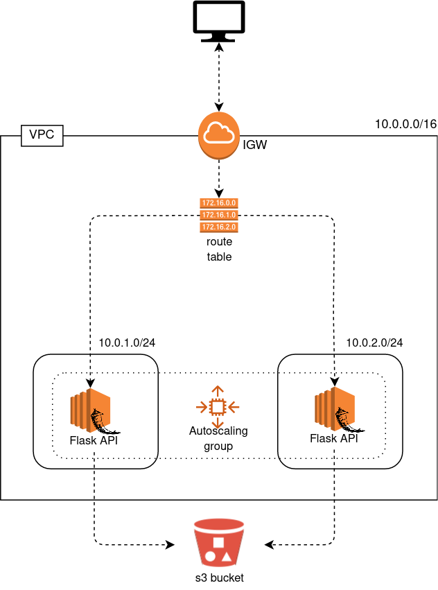

# Exercise 10 - Autoscaling group.

|                         |                    |
| -----------------------:| ------------------ |
|   Turn-in directory:    |  ex10              |
|   Files to turn in:     |  02_asg.tf, *.tf, *.tfvars |
|   Forbidden function:   |  None              |
|   Remarks:              |  n/a               |

Any Cloud provider is based on a pay as you go system. This system allows us not to pay depending on the number of users we have. If we have 10 users our t2.micro EC2 may be sufficient for our Flask application but if tomorrow 1000000 users want to try our super API we have to find a way to scale our infrastructure !

This can be done trough autoscaling groups. The more traffic we have the more EC2 instances will spawn to handle the growing traffic. Of course those new instances will be terminated if the number of users goes down.

{width=300px}

## Exercise

Transform your `02_ec2.t` terraform file into `02_asg.tf`. You will have to transform your code into an autoscaling group.

You need to implement a lauch configuration with your EC2 parameters and add a create before destroy lifecyle.

Create an autoscaling group with :
- a dependency on the launch configuration
- a link to the subnets of our vpc
- the lauch configuration you previously created
- a minimal and maximal size of your autoscaling group will be 2 (this will allow us to always keep 2 instances up even if one terminates)
- a tag with:
    - `Autoscaling Flask` for a key
    - `flask-asg` for the value
    - the propagate at launch option

You should see 2 EC2 created within your console.