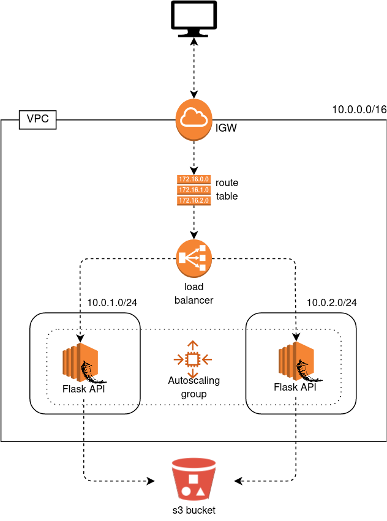

# Exercise 11 - Load balancer.

|                         |                    |
| -----------------------:| ------------------ |
|   Turn-in directory:    |  ex11              |
|   Files to turn in:     |  03_elb.tf, 02_asg.tf, *.tf, *.tfvars |
|   Forbidden function:   |  None              |
|   Remarks:              |  n/a               |

Let's finish our infrastructure ! With our autoscaling group we now have 2 instances but we still need to go to our AWS console to search the ip of each EC2 instance. It's not convenient !

A solution is to create a load balancer. A load balancer as its name indicates will balance the traffic between EC2 instances (of our autoscaling group here).

{width=300px}

## Exercise

Create a security group for your load balancer. It must :
- depend on the vpc you created 
- allow traffic from port 5000

Create a load balancer with :
- a health check on port 5000 every 30 sec and a healthy threshold at 2
- a listener on the port 5000
- the cross-zone load balancing option

In your autoscaling group add your load balancer and a health check type of type `ELB`.

Create a terraform output that will display the DNS name of your load balancer.

You should be able to use the DNS name of your load balancer to call the API now ! 