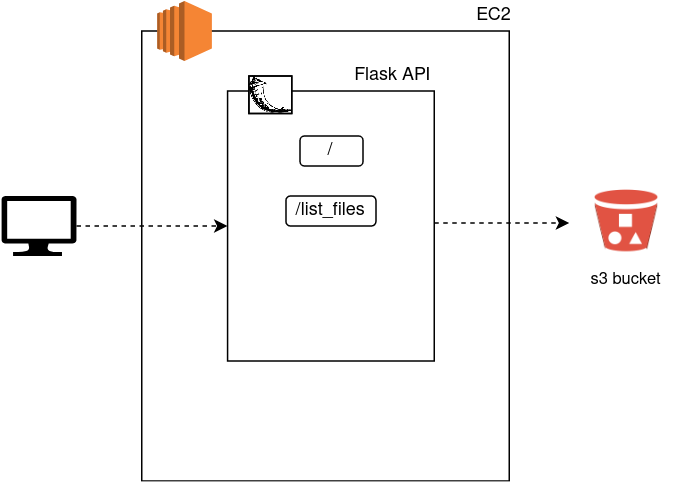

# Exercise 03 - Flask API - List

|                         |                    |
| -----------------------:| ------------------ |
|   Turn-in directory:    |  ex03              |
|   Files to turn in:     |  client.py app.py, \*.py |
|   Forbidden function:   |  None              |
|   Remarks:              |  n/a               |

Before getting into AWS infrastructure, we are going to discover how to interact with AWS resources using a Python SDK (Software Development Kit) called boto3. We are going to work with a python micro framework called Flask to create an API (a programmatic interface) to interact with your s3 bucket. For now, the API will be built locally to ease the development.

{width=400px}

nb: for a simplification of the following exercises we are going to use Flask directly like a development environment. If we wanted a more production-ready application we would add a webserver like Nginx/Apache linked with Gunicorn.

## Exercise

Create a server `app.py` with 3 routes:

- **`/`**
    - **status** : `200`
    - **message** : `Successfully connected to module02 upload/download API`
- **`/list_files`** :
    - **status** : `200`
    - **message** : `Successfully listed files on s3 bucket '<bucket_name>'`
    - **content** : list of files within the s3 bucket
- **`/delete/<filename>`** :
    - **status** : `200`
    - **message** : `Successfully deleted file '<filename>' on s3 bucket '<bucket_name>'`

The content you return with your Flask API has to be json formatted. You should use boto3 to interact with the s3 bucket you previously (`module02-...`).

Create a client `client.py` that will call the API you are creating and show results in a more human readable way. The client must implement two options:

- **`ping`**: call the route `/` of the API and print the message.
- **`list`**: call the route `/list_files` of the API and show the files on the bucket.
- **`delete`**: call the route `/delete/<filename>` of the API and delete a file on the bucket.

The client must also have an IP option to precise the location of the API (the default IP must be defined as `0.0.0.0`).