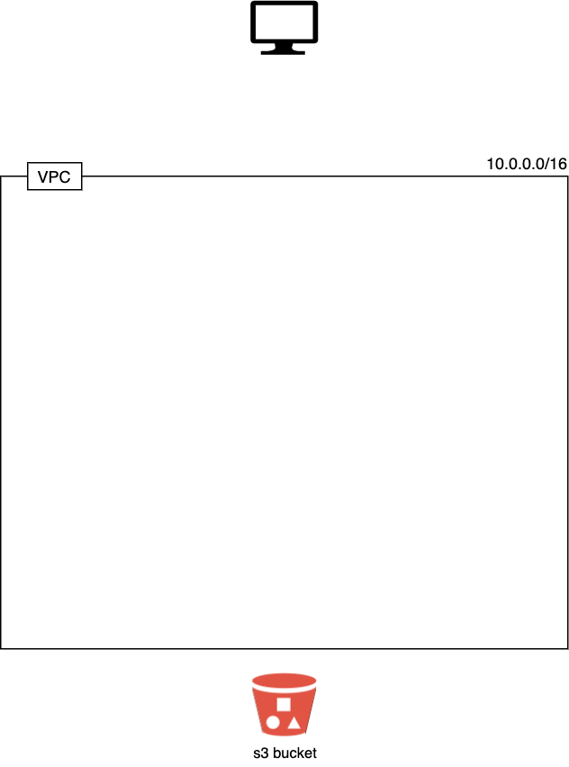

# Exercise 06 - Network

|                         |                    |
| -----------------------:| ------------------ |
|   Turn-in directory:    |  ex06              |
|   Files to turn in:     |  00_variables.tf, 01_networking.tf, 10_terraform.auto.tfvars |
|   Forbidden function:   |  None              |
|   Remarks:              |  n/a               |

Flask will run a service within our EC2 instance and with which we will be able to interact (through the instance IP and a specific port). To interact with an AWS resource, we have to grant certain permissions to the EC2 we previously created.The most secure way to do that is to use a role and to associate it with the EC2. Roles will grant the needed privileges when associated with a resource.


AWS and I lied to you! You thought deploying a server was that simple? A huge part of the required stack for the deployment is hidden! This hidden layer uses a wizard configuration (default configuration suitable for most users). The default configuration includes:
- network (VPC, subnets, CIDR blocks)
- network components (routing table, Internet gateway, NAT gateway)
- security (NACLS, security groups)

The default configuration allows you to use many services however the default security is open to the whole internet which is quite insecure!

To deploy an AWS infrastructure at a production level, we need to handle those layers ourselves. As you already know, we are using our free tier. However, if you let your server run for weeks you will have to pay. We want to avoid this possibility. That's why we are going to use a tool to automatically deploy and destroy our infrastructure, Terraform.

Terraform is a tool to deploy infrastructure as code. It can be used for multiple cloud providers (AWS, Azure, GCP, ...). We are going to use it to deploy our own virtual network and servers.

All potentially critical data **MUST NOT** be deployed using infrastructure as code like terraform. If they are, they may be destroyed accidentally and you never want that to happen!

## Terraform install

First, download the terraform software for macOS.

```
brew install terraform
```

You can now run the `terraform --version`. Terraform is ready!

Terraform is composed of three kinds of files:
- `.tfvars` : terraform variables.
- `.tf` : terraform infrastructure description.
- `.tfstate` : describe all the parameters of the stack you applied (is updated after an apply)

No further talking, let's deep dive into Terraform! 

## VPC

For this first exercise, you have to create a VPC (Virtual Private Cloud) using terraform. A VPC emulates a network within AWS infrastructure.

\clearpage

{width=300px}

Variables must be specified in variable files ! Your stack must only create a VPC.

For this exercise you must create 3 files:

- `00_variables.tf`: to declare variables
- `01_networking.tf`: to declare your stack
- `10_terraform.auto.tfvars`: to assign variables

You have to respect the following constraints:

- your vpc is deployed in Ireland (specified as the variable `region`).

- your vpc uses a `10.0.0.0/16` CIDR block.

- your vpc must enable DNS hostname (this will be useful for the next exercises)

- you must add two tags:

    - `project_name` with the value `module02` (this allows us to easily track all resources associated to a project)

    - `Name` with the value `module02-vpc`

On your AWS console, you can go in the VPC section to check if your VPC was correctly created.

You can run `terraform destroy` to delete your stack.
