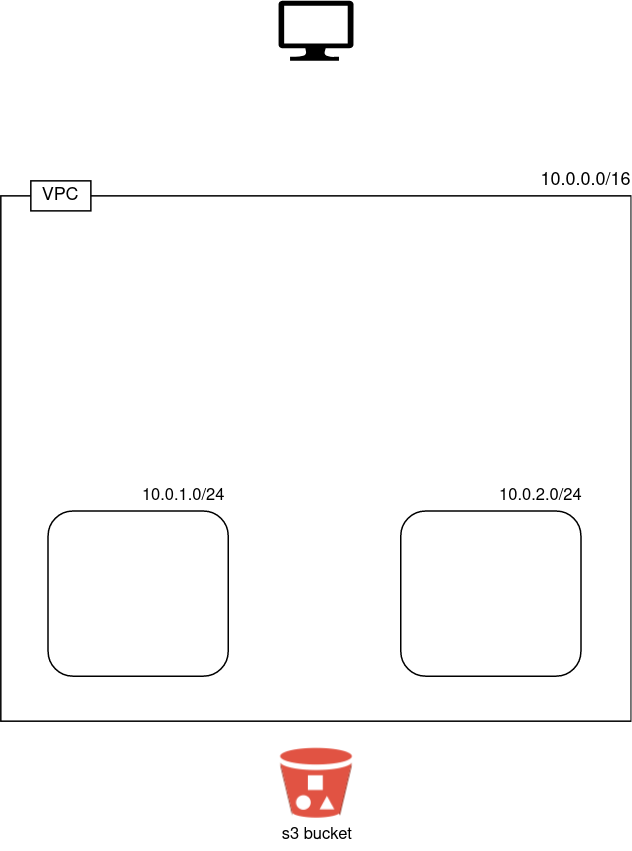

# Exercise 09 - Network

|                         |                    |
| -----------------------:| ------------------ |
|   Turn-in directory:    |  ex09              |
|   Files to turn in:     |  00_variables.tf, 01_networking.tf, 10_terraform.auto.tfvars |
|   Forbidden function:   |  None              |
|   Remarks:              |  n/a               |

AWS and I lied to you! You thought deploying a server was that simple? A huge part of the required stack for the deployment is hidden! This hidden layer uses a wizard configuration (default configuration suitable for most users). The default configuration includes:
- network (VPC, subnets, CIDR blocks)
- network components (routing table, Internet gateway, NAT gateway)
- security (NACLS, security groups)

## Exercise

For this new implementation we are going to recode more parts of our architecture like the network. We are going to use our own VPC to not rely on the default one. 

Create a VPC using terraform. You have to respect the following constraints:

- your vpc is deployed in Ireland (specified as the variable `region`).
- your vpc uses a `10.0.0.0/16` CIDR block.
- your vpc must enable DNS hostname (this will be useful for the next exercises)

On your AWS console, you can go in the VPC section to check if your VPC was correctly created.

Within our newly created VPC we want to divide the network's IPs into subnets. This can be useful for many different purposes and helps isolate groups of hosts together and deal with them easily. In AWS, subnets are often associated with different availability zones which guarantees the high availability in case an AWS data center is destroyed.

{width=300px}

Within our previously created VPC, add 2 subnets with the following characteristics:
- their depends on the creation of the VPC (it has to be specified on terraform)
- your subnets will use `10.0.1.0/24` and `10.0.2.0/24` CIDR blocks.
- your subnets will use `eu-west-1a` and `eu-west-1b` availability zones.
- they must map public ip on launch.
